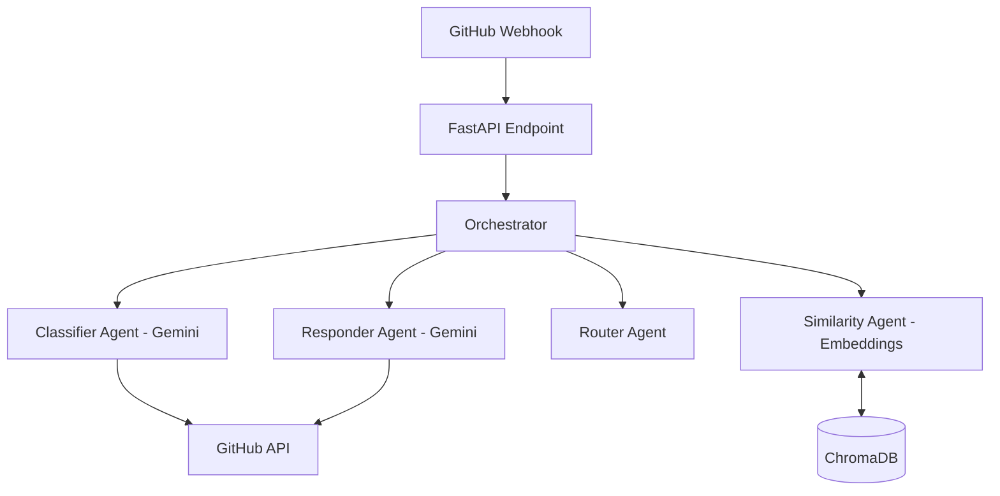

# TriageBot

<div align="center">


**An intelligent multi-agent system that automatically triages GitHub issues by classifying, prioritizing, routing, and responding to issues in real-time.**

[Features](#features) • [Architecture](#architecture) • [Getting Started](#getting-started) • [Deployment](#deployment)

</div>

---

## Overview

TriageBot reduces maintainer burden by 60-80% through AI-powered automation. It listens to your GitHub repository events and employs a suite of specialized agents to handle initial triage, allowing your team to focus on solving problems rather than sorting them.

## Features

- 🤖 **Intelligent Classification**: Uses Google Gemini 1.5 Flash to categorize issues (Bug, Feature, Question, etc.) with high accuracy.
- 🚦 **Smart Routing**: Automatically assigns issues to the correct team (Backend, Frontend, Security, DevOps) based on content analysis and rules.
- 💬 **Context-Aware Responses**: specific, helpful auto-replies generated by LLMs to acknowledge users and request missing information.
- 🏷️ **Auto-Labeling**: Applies appropriate labels to issues instantly via GitHub API.
- 🔍 **Duplicate Detection**: (Phase 2) Identifies potential duplicate issues using `sentence-transformers` embeddings and ChromaDB vector search.
- 🛡️ **Security**: Verifies all webhook signatures to ensure requests are legitimately from GitHub.

## Architecture

The system is built on a micro-agent architecture orchestrated by FastAPI:



### Tech Stack
- **Backend**: FastAPI, Uvicorn
- **AI/LLM**: Google Generative AI (Gemini 1.5 Flash)
- **Embeddings**: Sentence-Transformers (`all-MiniLM-L6-v2`)
- **Vector DB**: ChromaDB
- **Database**: SQLite (for session/state if needed)
- **Containerization**: Docker

## Getting Started

### Prerequisites
- Python 3.10+
- GitHub Account & Repository
- Google AI Studio API Key (Free)

### Installation

1. **Clone the repository**
   ```bash
   git clone https://github.com/sriksven/TriageBot.git
   cd TriageBot
   ```

2. **Set up Virtual Environment**
   ```bash
   python -m venv venv
   source venv/bin/activate
   ```

3. **Install Dependencies**
   ```bash
   pip install -r requirements.txt
   ```

4. **Configuration**
   Copy `.env.example` to `.env` and fill in your keys:
   ```bash
   cp .env.example .env
   ```
   
   required variables:
   - `GEMINI_API_KEY`: Your key from Google AI Studio
   - `GITHUB_TOKEN`: Personal Access Token with repo scope
   - `GITHUB_WEBHOOK_SECRET`: Secret used in your GitHub Webhook settings

5. **Run Locally**
   ```bash
   uvicorn app.main:app --reload
   ```

## Development

### Project Structure
```
triagebot/
├── app/
│   ├── agents/         # AI Agents (Classifier, Router, Responder)
│   ├── api/            # API Endpoints
│   ├── core/           # Security & Config
│   ├── services/       # External Services (GitHub, LLM, VectorStore)
│   └── main.py         # Application Entry
├── tests/              # Unit & Integration Tests
└── scripts/            # Helper scripts
```

### Running Tests
```bash
pytest tests/
```

## Deployment

### Docker
```bash
docker-compose up -d --build
```

### GitHub Webhook Setup
1. Go to Repository Settings > Webhooks
2. Add webhook: `https://your-domain.com/api/v1/webhooks/github`
3. Content type: `application/json`
4. Secret: Same as `GITHUB_WEBHOOK_SECRET`
5. Events: Select "Issues"

## License

MIT
